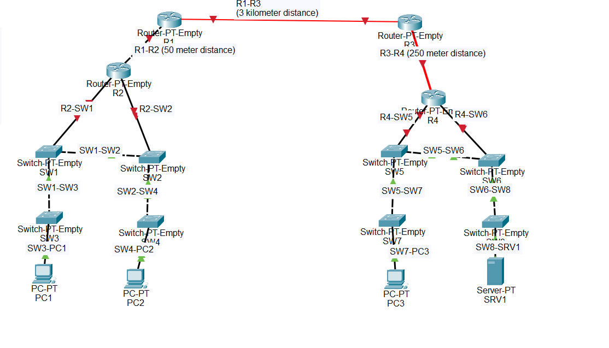

# Day 02 - Network Devices and Cabling

## Overview

Today's lab focused on understanding different network interfaces and selecting the correct cable type based on:

- Device type
- Interface type
- Network distance
- Copper vs Fiber connections

Instead of randomly connecting devices, every connection was chosen based on real-world networking standards.

---

## Objectives

- Learn different network interfaces
- Identify when to use UTP and Fiber cables
- Understand cable distance limitations
- Connect routers, switches, PCs and servers correctly
- Build a network using appropriate media

---

## Devices Used

- 4 Routers
- 8 Switches
- 3 PCs
- 1 Server

---

## Cabling Decisions

### Copper (UTP)

Used for:

- Router → Switch
- Switch → Switch (short distance)
- Switch → PC
- Switch → Server

Reason:

- Cost effective
- Easy to deploy
- Suitable for short distances

Maximum recommended distance:

- 100 meters

---

### Multimode Fiber

Used when:

- Distance exceeds copper limitations
- Distance is less than approximately 550 meters

Advantages:

- Faster than copper
- Suitable for building-to-building connections
- Less signal interference

---

### Single Mode Fiber

Used when:

- Distance exceeds 550 meters

Advantages:

- Supports several kilometers
- Lowest signal loss
- Preferred for long-distance backbone links

---

## Cable Choices in this Lab

| Connection | Distance | Cable Selected | Reason |
|------------|----------|---------------|--------|
| R1 → R2 | 50 m | Copper UTP | Within copper limit |
| R2 → SW1 | Short | Copper UTP | Router to switch |
| R2 → SW2 | Short | Copper UTP | Router to switch |
| SW1 → SW3 | Short | Copper UTP | Switch uplink |
| SW2 → SW4 | Short | Copper UTP | Switch uplink |
| SW3 → PC1 | Short | Copper UTP | End device |
| SW4 → PC2 | Short | Copper UTP | End device |
| R3 → R4 | 250 m | Multimode Fiber | Beyond copper limit but under 550 m |
| R1 → R3 | 3 km | Single Mode Fiber | Long-distance backbone |
| R4 → SW5 | Short | Copper UTP | Router to switch |
| R4 → SW6 | Short | Copper UTP | Router to switch |
| SW5 → SW7 | Short | Copper UTP | Switch uplink |
| SW6 → SW8 | Short | Copper UTP | Switch uplink |
| SW7 → PC3 | Short | Copper UTP | End device |
| SW8 → SRV1 | Short | Copper UTP | Server connection |

---

## Key Concepts Learned

- Different network devices use different interfaces.
- Copper Ethernet cables are suitable up to 100 meters.
- Fiber optic cables are required for longer distances.
- Multimode fiber is ideal for medium-distance connections.
- Single mode fiber is used for long-distance backbone links.
- Proper cable selection improves reliability and performance.

---

## Skills Practiced

- Network topology design
- Cable selection
- Interface identification
- Distance planning
- Physical network design
- Cisco Packet Tracer

---

## Files

- Day 02 Lab.pkt
- topology.png

---

## Preview

---

## What I Learned

This lab taught me that network design starts with the physical layer. Choosing the correct transmission media based on distance and device type is essential for building reliable networks. I also gained practical experience identifying network interfaces and connecting routers, switches, PCs, and servers using industry-standard cabling practices.
